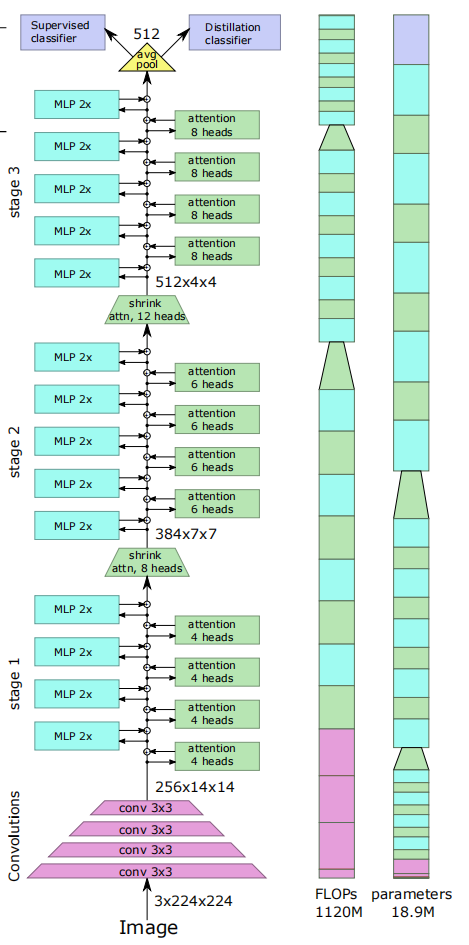

# trt2022_levit

## 总述

- 模型名称：LeViT， https://github.com/facebookresearch/LeViT. 
- 我们进行了FP16和INT8的优化，并在使用Nsight System进行了针对性latency分析之后，选择对softmax进行手动编写插件优化。最终我们的模型可以取得相比于PyTorch推理1.7倍的加速。

## 运行步骤

- 环境准备：

拉取TensorRT Docker镜像： 

```shell
docker run --gpus all -it --rm nvcr.io/nvidia/tensorrt:22.05-py3
```

拉取代码repo：

```shell
git clone https://github.com/ModelACC/trt2022_levit.git
```

在代码目录下，安装python依赖：

```shell
pip3 install -r requirements.txt --extra-index-url https://download.pytorch.org/whl/cu113
```

- 运行softmax plugin构建和测速脚本：
  
  ```shell
  cd LeViT 
  ./build_engine_run_plugin.sh
  ```

- 构造TensorRT引擎：

```shell
cd LeViT
# Conver pytorch model to onnx model.
# MODEL can be one of 128S, 128, 192, 256, 384
# For example, 384 means LeViT-384
python3 trt_convert_onnx.py MODEL
# build TensorRT engine
python3 trt_build_engine.py --onnx-path ONNX_MODEL --engine-path ENGINE_PATH [--enable-fp16] [--enable-int8]
```

- 测试模型精度

```shell
python3 valid.py \
--data-path IMAGENET_ROOT \
--model MODEL_NAME \
--type TYPE \
--engine-path ENGINE_PATH
```

IMAGENET_ROOT: imagenet数据集的根目录。数据集目录需为以下储存格式：

> IMAGENET_ROOT
> 
> ----| val
> 
> --------| n02089867
> 
> ------------| XXX.jpg
> 
> ------------| ......
> 
> --------| n02437616
> 
> ------------| YYY.jpg
> 
> ------------| ......
> 
> --------| ......

MODEL_NAME：模型名字，可以为LeViT_384，LeViT_256等，具体参见原repo。

TYPE： pytorch或者tensorrt，代表要测试的是PyTorch模型还是TensorRT模型。

ENGINE_PATH：若TYPE为tensorrt，则还需要传入引擎文件。

- 测试模型推理速度

对于TensorRT模型，可以使用trtexec测速：

```shell
trtexec --loadEngine=ENGINE_PATH --shapes=input:16x3x224x224 --useSpinWait
```

对于PyTorch模型，使用python脚本文件测速：

```shell
python3 pytorch_speed_test.py
```

- 生成calibration数据集：

```shell
python3 generate_calibration_data.py --data-path IMAGENET_ROOT
```

## 原始模型

### 1. 模型简介

- 我们小组选择优化的模型是来自于FaceBook Research的LeViT, 一种基于Transformer的用于快速推理图像分类的混合模型。该模型在推理精度上和运行速度上取得了较好的平衡。在同等精度之下，该模型相比于其他视觉Transformer的SOTA模型例如Visual Transformer，Bottleneck transformer和pyramid vision transformer能有近5倍的速度提升。相比于其他Token-to-token ViT模型，LeViT也有更少的参数和FLOPs。因此，LeViT是一个相对较为轻量化的模型，其较好的性能表现也保证了该模型较好的实用性。

### 2.模型结构

- 模型的整体结构如下图所示。输入的图片通过pyramid convolution 提取Embedding，随后输入到三个连续的stage中。最后一个stage的输出会作为分类器的输入，并得到图像分类的结果。
- 在数据输入到attention layer之前经过了一个pyramid convolution的处理。它由4个连续的3*3卷积核组成，且输出的feature map的维度逐级提升。该网络结构的目的在于提取patch embedding，并提高网络的精度。
- 在每个stage中，输入数据会通过一系列的multi-head attention layer和用于残差连接的MLP Layer。其中，multi-head attention和一般常见的Transformer类模型中的Attention是基本相同的。但在LeViT的attention layer中并没有用到常见的positional embedding，而是在计算Attention的QK乘积是加入了一个Attention Bias充当positional embedding的作用。而MLP layer在本模型中是1*1的卷积层和一个batch normalization layer。根据论文，作者之所以没有采用常见的MLP block的原因是考虑到了常见的MLP通常会有更大的计算开销，从而采用了该模型中的结构用于残差连接。
- 同时，在每两个stage之间，有一个multi-head shrink attention layer。该层会让输出的feature map的宽高减半，并提高其维度，从而起到下采样的作用。这一层的结构和LeViT中的Multi-head Attention是基本一致的，唯一不同的地方在于在Q Transformation之前对输入进行了下采样，从而最终得到了"shrink attention"的效果。
    

## 优化过程

### 1. Nsight System 性能分析

- 如下图中的性能分析图和表所示，在运行期中，除了矩阵乘法运算和卷积运算之外，Softmax函数也占用了大量的运算时间。因此，在该函数运算上还有一定的优化空间，我们采取开发TensorRT Plugin的方式尝试去优化。
  
  

### 2. Softmax Plugin 开发

- Softmax Kernel Function 来源于 https://github.com/Oneflow-Inc/oneflow/blob/master/oneflow/core/cuda/softmax.cuh 
- 性能提升效果：原模型Softmax函数的输入形状为[batch_size, 3, 196, 196]，我们取batch_size = 8，分别对原生Softmax和Softmax Plugin进行测试。在不损失精度的条件下，Softmax Plugin的运行时间为原生Softmax的61%. 对于LeViT模型的试验，我们采用LeViT-384模型进行性能评估。模型输入形状为 [batch_size = 8, 3,224,224]，性能的提升约为5% 

### 3. INT8量化

为了取得更好的加速效果，除了常规的FP32和FP16以外，我们也对模型进行了INT8量化。我们使用的是TensorRT提供的PTQ量化流程，即手动编写calibrator，并在构造引擎的时候开启INT8量化和传入calibrator。

不出意料，INT8量化后模型精度下降了16个点（从82.6下降到66）。根据以往的比赛经验，INT8量化后容易出问题的层分别是Softmax，激活层和BN层。LeViT在导出ONNX的时候已经进行了BN和卷积的融合，故不需要考虑BN。经过实验，Softmax层对精度并无影响，在手动不量化Sigmoid激活函数层之后，模型精度恢复到76（恢复了10个点）。

## 精度与加速效果

所有实验均在A10 GPU上进行。batch大小为16，单张图片大小为3x224x224，有warmup。

| LeViT-384       | acc@1 | latency (ms) | Acceleration Ratio |
| --------------- | ----- | ------------ | ------------------ |
| Pytorch (GPU)   | 82.6  | 8.91         | x1                 |
| TensorRT (FP32) | 82.6  | 8.28         | x1.08              |
| TensorRT (FP16) | 82.6  | 5.38         | x1.66              |
| TensorRT (INT8) | 76.0  | 5.05         | x1.76              |

| LeViT-256       | acc@1 | latency (ms) | Acceleration Ratio |
| --------------- | ----- | ------------ | ------------------ |
| Pytorch (GPU)   | 81.6  | 5.72         | x1                 |
| TensorRT (FP32) | 81.6  | 5.40         | x1.06              |
| TensorRT (FP16) | 81.5  | 3.42         | x1.67              |
| TensorRT (INT8) | 81.2  | 3.52         | x1.63              |
