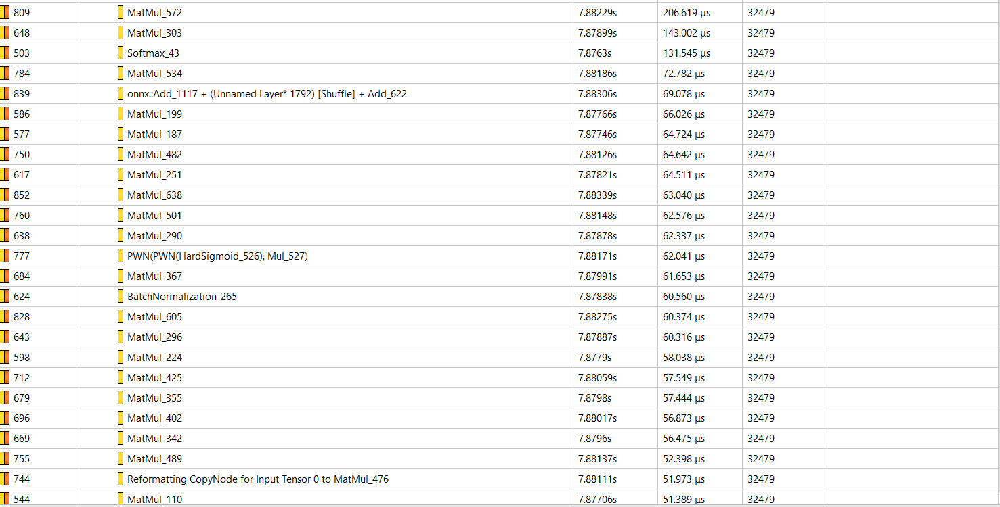
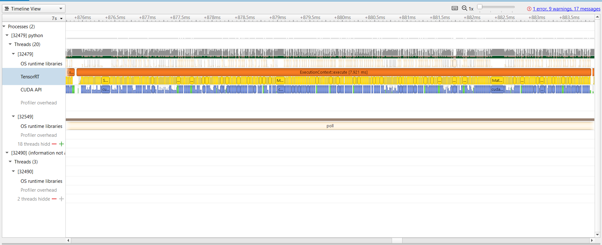

# trt2022_levit
## 总述
- 模型名称：LeViT， https://github.com/facebookresearch/LeViT. 
## 运行脚本
- 运行softmax plugin构建和测速脚本：
```commandline
cd LeViT 
./build_engine_run_plugin.sh
```
## 原始模型
### 1. 模型简介
- 我们小组选择优化的模型是来自于FaceBook Research的LeViT, 一种基于Transformer的用于快速推理图像分类的混合模型。该模型在推理精度上和运行速度上取得了较好的平衡。在同等精度之下，该模型相比于其他视觉Transformer的SOTA模型例如Visual Transformer，Bottleneck transformer和pyramid vision transformer能有近5倍的速度提升。相比于其他Token-to-token ViT模型，LeViT也有更少的参数和FLOPs。因此，LeViT是一个相对较为轻量化的模型，其较好的性能表现也保证了该模型较好的实用性。
### 2.模型结构
- 模型的整体结构如图所示（图x）。输入的图片通过pyramid convolution 提取Embedding，随后输入到三个连续的stage中。最后一个stage的输出会作为分类器的输入，并得到图像分类的结果。
- 在数据输入到attention layer之前经过了一个pyramid convolution的处理。它由4个连续的3*3卷积核组成，且输出的feature map的维度逐级提升。该网络结构的目的在于提取patch embedding，并提高网络的精度。
- 在每个stage中，输入数据会通过一系列的multi-head attention layer和用于残差连接的MLP Layer。其中，multi-head attention和一般常见的Transformer类模型中的Attention是基本相同的。但在LeViT的attention layer中并没有用到常见的positional embedding，而是在计算Attention的QK乘积是加入了一个Attention Bias充当positional embedding的作用。而MLP layer在本模型中是1*1的卷积层和一个batch normalization layer。根据论文，作者之所以没有采用常见的MLP block的原因是考虑到了常见的MLP通常会有更大的计算开销，从而采用了该模型中的结构用于残差连接。
- 同时，在每两个stage之间，有一个multi-head shrink attention layer。该层会让输出的feature map的宽高减半，并提高其维度，从而起到下采样的作用。这一层的结构和LeViT中的Multi-head Attention是基本一致的，唯一不同的地方在于在Q Transformation之前对输入进行了下采样，从而最终得到了"shrink attention"的效果。
### 3. 模型优化难点

## 优化过程
### 1. Nsight System 性能分析
- 如下图中的性能分析图和表所示，在运行期中，除了矩阵乘法运算和卷积运算之外，Softmax函数也占用了大量的运算时间。因此，在该函数运算上还有一定的优化空间，我们采取开发TensorRT Plugin的方式尝试去优化。


### 2. Softmax Plugin 开发 
- Softmax Kernel Function 来源于 https://github.com/Oneflow-Inc/oneflow/blob/master/oneflow/core/cuda/softmax.cuh 
- 性能提升效果：原模型Softmax函数的输入形状为[batch_size, 3, 196, 196]，我们取batch_size = 8，分别对原生Softmax和Softmax Plugin进行测试。在不损失精度的条件下，Softmax Plugin的运行时间为原生Softmax的61%. 对于LeViT模型的试验，我们采用LeViT-384模型进行性能评估。模型输入形状为 [batch_size = 8, 3,224,224]，性能的提升约为10% 
- 需要注意的是，运行时间的结果并不稳定，以上为多次试验后得到的大致数据。
## 精度与加速效果
## Bug报告
